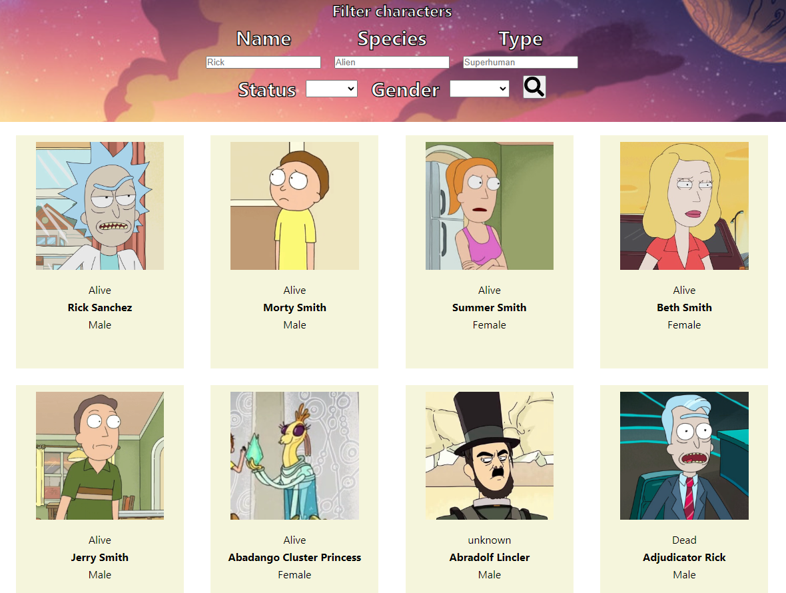
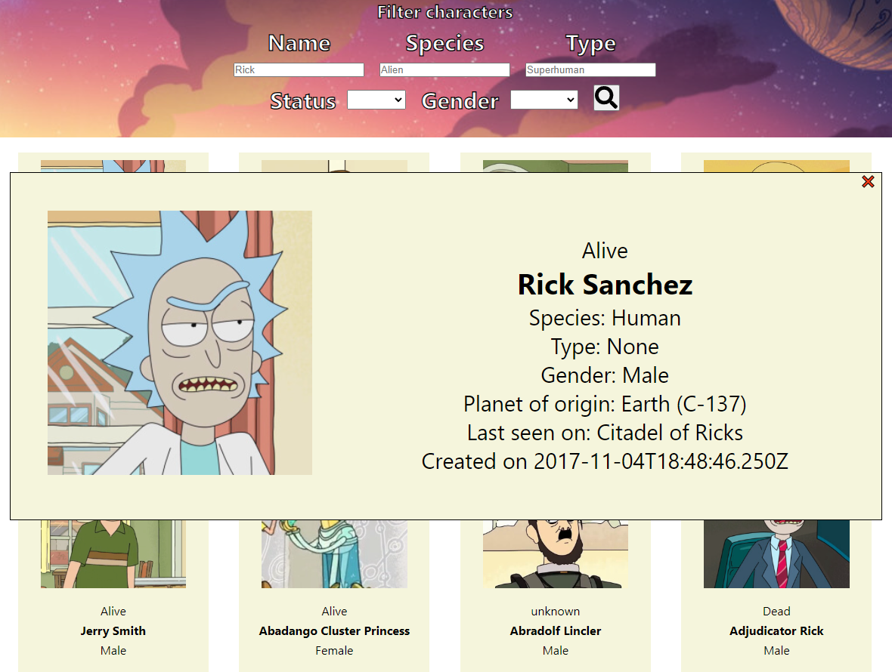
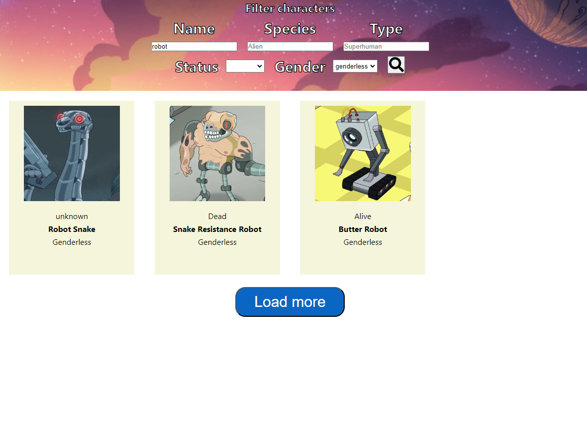

# Rick&Morty API Test Task

Проект разработан при помощи create-react-app с использованием TypeScript на основе существующего моего проекта с похожей задачей. Помимо стандартных библиотек были подключены:

- react-redux и redux-toolkit: менеджер состояний;
- axios: для более удобных запросов;
- react-icons: для красивой кнопки поиска;
- styled-components: для стилизации;

## Функционал

- Пользователь может удобно просматривать всех персонажей и информацию о них (имя, статус, гендер), предоставляемые API.
- Можно фильтровать персонажей по имени, статусу, виду, типу и полу.
- Вышеуказанные фильтры могут применяться все вместе.
- Пользователь может открыть всплывающее окно (popup) с полной информацией о персонаже.

## Пример работы приложения

## Available Scripts

Доступные скрипты для разработки и билда:

### `npm start`

Runs the app in the development mode.\
Open [http://localhost:3000](http://localhost:3000) to view it in the browser.

The page will reload if you make edits.\
You will also see any lint errors in the console.

### `npm run build`

Builds the app for production to the `build` folder.\
It correctly bundles React in production mode and optimizes the build for the best performance.

The build is minified and the filenames include the hashes.\
Your app is ready to be deployed!

See the section about [deployment](https://facebook.github.io/create-react-app/docs/deployment) for more information.
