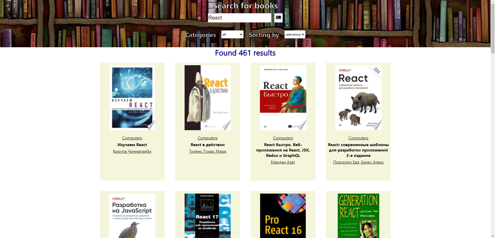

# Google Books API Test Task

Проект разработан при помощи create-react-app с использованием TypeScript. Помимо стандартных библиотек были подключены:

- react-redux и redux-toolkit: менеджер состояний;
- axios: для более удобных запросов;
- react-icons: для красивой кнопки поиска;

## Функционал

- Присутствуют текстовое поле и кнопка поиска. По введенной пользователем подстроке производится поиск книг. Триггером к поиску является либо нажатие Enter (когда текстовое поле в фокусе), либо нажатие кнопки поиска.
- Фильтрация по категориям. Ниже текстового поля располагается селект с категориями: all, art, biography, computers, history, medical, poetry. Если выбрано "all" (выбрано изначально), то поиск производится по всем категориям.
- Сортировка. Рядом с селектом категорий находится селект с вариантами сортировки: relevance (выбран изначально), newest.
- Найденные книги отображаются карточками, каждая из которых состоит из изображения обложки книги, названия книги, названия категории и имен авторов. Если для книги приходит несколько категорий, то отображается только первая. Авторы отображаются все.
- Над блоком с карточками отображается количество найденных по запросу книг.
- Пагинация реализована по принципу 'load more'. Ниже блока с карточками находится кнопка 'Load more', по клику на нее к уже загруженным книгам подгружаются еще. Шаг пагинации - 30.
- При клике на карточку происходит переход на детальную страницу книги, на которой выводятся ее данные: изображение обложки, название, все категории, все авторы, описание.

## Пример работы приложения

## Available Scripts

Доступные скрипты для разработки и билда:

### `npm start`

Runs the app in the development mode.\
Open [http://localhost:3000](http://localhost:3000) to view it in the browser.

The page will reload if you make edits.\
You will also see any lint errors in the console.

### `npm run build`

Builds the app for production to the `build` folder.\
It correctly bundles React in production mode and optimizes the build for the best performance.

The build is minified and the filenames include the hashes.\
Your app is ready to be deployed!

See the section about [deployment](https://facebook.github.io/create-react-app/docs/deployment) for more information.
